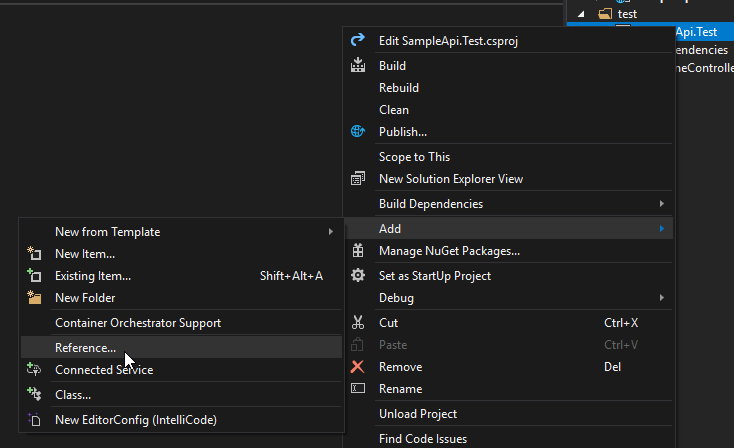
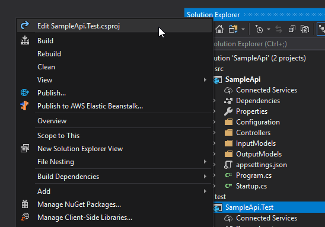

# Adding Unit Test Project

For this activity, please ensure you have completed [Activity 11](11-DockerCompose.md).

## Activity Steps

1. Create a new Solution Folder called 'Test'.
2. Add a new XUnit based unit test project called 'SampleApi.Test', ensuring the location places the new project into a physical directory called 'Test' under your solution root directory.
 


3. Add a project reference to the SampleApi project from the new SampleApi.Test project.



*If you prefer to do this via the command line you can run the following command from your solution root directory*

```dotnet add test/SampleApi.Test/SampleApi.Test.csproj reference src/SampleApi/SampleApi.csproj```

4. Add a NuGet package for the 'Moq' mocking library


*If you prefer to do this via the command line you can run the following command from your solution root directory*

```dotnet add test/SampleApi.Test/SampleApi.Test.csproj package Moq```

5. Add a NuGet package for the 'FluentAssertions' library

*If you prefer to do this via the command line you can run the following command from your solution root directory*

```dotnet add test/SampleApi.Test/SampleApi.Test.csproj package FluentAssertions```

6. Edit your SampleApi.Test project
 


7. Change the SDK at the top of the project file from 'Microsoft.NET.Sdk' to 'Microsoft.NET.Sdk.Web'.

8. Add an implicit reference to the aspnetcore metapackages to the PackageReference ItemGroup section 

```<PackageReference Include="Microsoft.AspNetCore.App" />```

At this point your project file should look like this...

```xml
<Project Sdk="Microsoft.NET.Sdk.Web">

  <PropertyGroup>
    <TargetFramework>netcoreapp2.1</TargetFramework>
    <IsPackable>false</IsPackable>
  </PropertyGroup>

  <ItemGroup>
    <PackageReference Include="FluentAssertions" Version="5.5.0" />
    <PackageReference Include="Microsoft.AspNetCore.App" />
    <PackageReference Include="Microsoft.NET.Test.Sdk" Version="15.8.0" />
    <PackageReference Include="Moq" Version="4.10.0" />
    <PackageReference Include="xunit" Version="2.3.1" />
    <PackageReference Include="xunit.runner.visualstudio" Version="2.3.1" />
  </ItemGroup>

  <ItemGroup>
    <ProjectReference Include="..\..\src\SampleApi\SampleApi.csproj" />
  </ItemGroup>

</Project>
```

9. Rename the default 'UnitTest1' class to 'SampleControllerTests' using your preferred refactoring approach (also updating the file name).

10. Rename the 'Test1' method to 'Hello_Should_ReturnExpectedWelcomeMessage'

11. Add the following body to the method which will excercise the Hello method...

```csharp
[Fact]
public void Hello_Should_ReturnExpectedWelcomeMessage()
{
    const string welcomeMessage = "TEST";
    const string name = "Bob";

    var expectedWelcome = $"{welcomeMessage} {name}";

    var mockOptions = new Mock<IOptions<MessagesConfiguration>>();
    mockOptions.Setup(x => x.Value).Returns(new MessagesConfiguration { WelcomeMessage = welcomeMessage });

    var sut = new SampleController(mockOptions.Object, new NullLogger<SampleController>());

    var actionResult = sut.Hello(name);

    var okResult = actionResult.Result.Should().BeAssignableTo<OkObjectResult>()
        .Which.Value.Should().BeAssignableTo<HelloOutputModel>()
            .Which.WelcomeMessage.Should().Be(expectedWelcome);
}
```

12. Include any required Using statements.

13. Run the unit test via your preferred test runner.

*If you prefer to do this via the command line you can run the following command from your solution root directory*

```dotnet test test/SampleApi.Test/SampleApi.Test.csproj```

## End of Activity

The completed example for this activity can be found in the '/steps/12-Unit-Tests' folder.

[Return to README and activity links](../README.md)